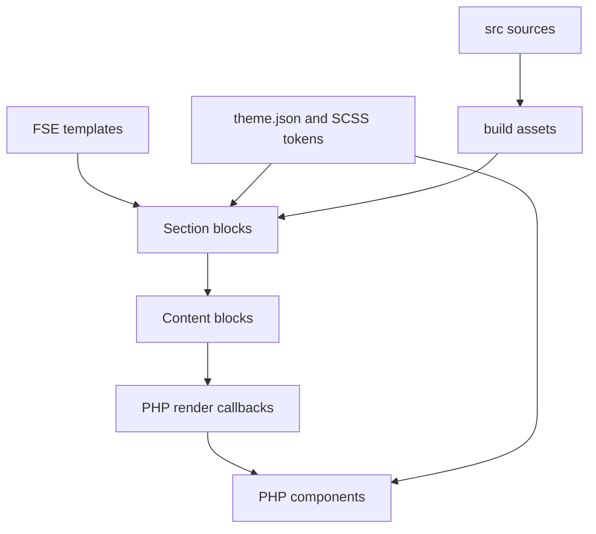

# Architecture

## Purpose

JMC Custom Theme is a Full Site Editing theme with a small WordPress bootstrap, dynamic custom blocks, reusable PHP view components, and shared design tokens for the editor and frontend.

## Runtime flow

## Responsibilities

### Bootstrap and modules

`functions.php` wires together focused modules and helpers:

- `inc/setup.php` declares theme support and editor styles.
- `inc/enqueue.php` loads the compiled shared stylesheet when it exists and uses its modification time for cache busting.
- `inc/blocks.php` recursively registers compiled block metadata, registers the section category, and applies the current editor allowlist.
- `inc/helpers/` contains reusable framework-level PHP helpers.

Feature logic should not accumulate in the bootstrap.

### Blocks

Source metadata and editor code live in `src/blocks/content/` and `src/blocks/layouts/`; production compilation writes to `build/js/blocks/`. Registration scans each compiled directory containing `block.json`.

The current library contains nine dynamic blocks:

- Four insertable sections: `cta-banner`, `hero`, `service-grid`, and `text-with-image`.
- Five composition blocks: `button`, `column`, `heading`, `paragraph`, and `service-card`.

Attributes crossing from the editor into PHP are untrusted. Render code must validate allowlisted values, escape at the final boundary, and avoid meaningless empty markup.

### Components and helpers

`jmc_component()` resolves names beneath `components/` and delegates to WordPress template-part loading. Components own reusable markup; blocks own Gutenberg attributes, context, and composition.

Use the typed argument helpers in `inc/helpers/component-args.php` and escaped HTML-attribute helpers in `inc/helpers/html/attributes.php`. Do not concatenate raw attributes into markup.

### Styling and tokens

`theme.json` exposes WordPress-facing colour, typography, spacing, radius, and layout primitives. SCSS maps them into semantic roles, palettes, layouts, components, and block rules. Frontend and editor entry points share the same foundations.

### Build and package

`src/` is the source of truth. `npm run build` creates runtime assets under `build/`. `npm run package` recreates `dist/` with runtime PHP, templates, components, configuration, and compiled assets. CI verifies the package structure, but clean WordPress installation/activation remains planned release-hardening work.

## Dependency rules

1. `functions.php` may depend on `inc/`; feature logic stays out of the bootstrap.
2. Blocks may use components and helpers.
3. Components may use helpers but must not depend on a specific block.
4. Helpers must not render a specific feature.
5. Generated files must never become the source of truth.
6. Presentation variants use allowlists and semantic class names.

## Naming

- PHP functions: `jmc_` prefix and `snake_case`.
- Blocks: `jmc/<name>`.
- CSS classes: `jmc-` prefix with BEM-style elements where useful.
- Text domain: `jmc-theme` in PHP, TypeScript, and block metadata.

The `style.css` header currently uses `jmc-custom-theme`; align it before release.

## Known constraints

- The global block allowlist exposes only `jmc/` blocks and must become context-aware before header, navigation, query, and broader FSE workflows are completed.
- Some internal block metadata still uses legacy, unregistered categories.
- TypeScript strict mode is disabled and existing contracts contain weak typing.
- Header/footer template parts, patterns, and full template coverage are not implemented.
- Automated behavioural and accessibility tests are not configured.
- Packaging uses Unix-specific shell tools and is not clean-install tested.
- Production hosting, deployment, health-check, and rollback commands are undecided.

Track architectural changes through focused issues. Add short decision records under `docs/adr/` when a decision materially affects multiple blocks, workflows, or future maintainers.
