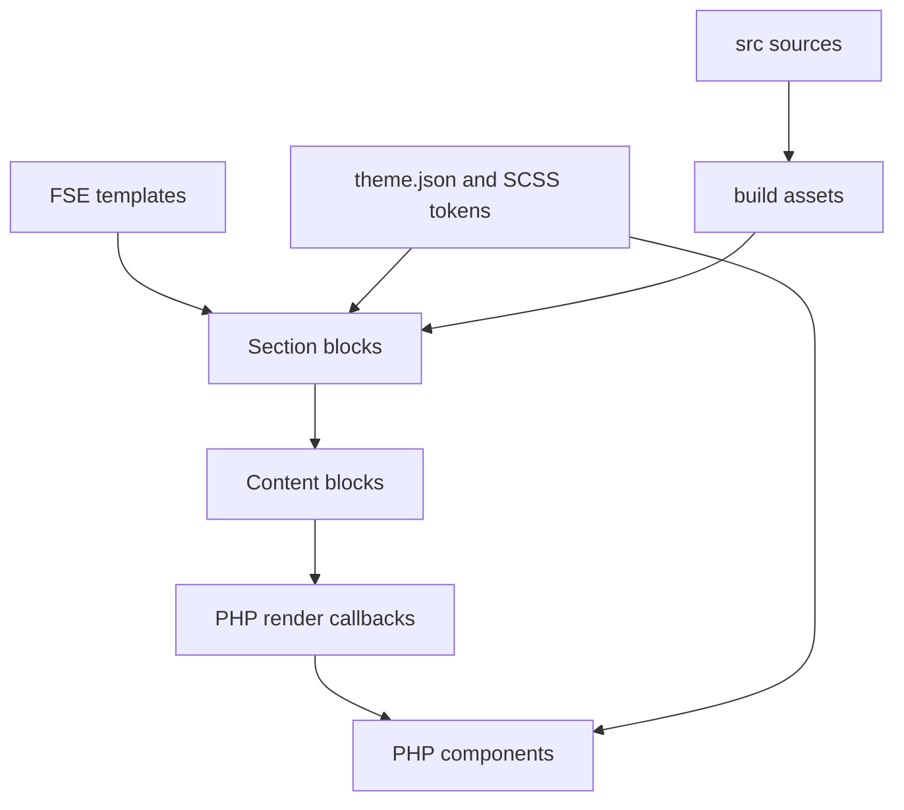

# Architecture

## Purpose

JM Custom Theme is a Full Site Editing theme with a deliberately small WordPress bootstrap, dynamically rendered custom blocks, reusable PHP view components, and a shared token system for the editor and frontend.

## Runtime flow

## Responsibilities

### Bootstrap

`functions.php` loads the modules under `inc/`. Keep it declarative: it should wire modules together, not contain feature logic.

### Theme modules

- `inc/setup.php` declares WordPress theme support and editor styles.
- `inc/enqueue.php` loads the compiled shared stylesheet and uses the file modification time for cache busting.
- `inc/blocks.php` discovers compiled block metadata under `build/js/blocks`, registers custom block categories, and controls the editor block allowlist.
- `inc/helpers/` contains reusable, framework-level PHP helpers.

### Blocks

Block metadata and editor code originate in `src/blocks/content/` and `src/blocks/layouts/`, then compile to `build/js/blocks`. WordPress recursively registers each compiled directory containing a `block.json`. All nine current blocks are dynamic and delegate frontend output to PHP render files and reusable components.

The four layout blocks (`cta-banner`, `hero`, `service-grid`, and `text-with-image`) are editor-insertable sections. The five content blocks are composition primitives; their metadata currently disables direct insertion so layouts control the authoring experience.

Attributes crossing the editor/PHP boundary are untrusted input. Render code must validate allowed values, escape output at the final boundary, and return no markup for genuinely empty states.

### Components

`jm_component()` resolves a component name beneath `components/` and passes arguments through WordPress template-part loading. Components own reusable markup; blocks own Gutenberg-specific attributes, context, and composition.

Use the typed argument helpers in `inc/helpers/component_args.php` and the escaped attribute helpers in `inc/helpers/html/attributes.php`. Do not concatenate raw attributes into HTML.

### Styling and design tokens

`theme.json` exposes WordPress-facing primitives such as colour, typography, spacing, radii, and layout widths. `scripts/generate-tokens.mjs` supports generated token output. SCSS maps primitives into aliases, semantic roles, palettes, layout rules, components, and blocks. Both frontend and editor entry points consume the shared foundations.

## Dependency rules

1. `functions.php` may depend on `inc/`, but feature logic must stay out of the bootstrap.
2. Blocks may use components and helpers.
3. Components may use helpers but must not depend on a particular block.
4. Helpers must not render a specific feature.
5. Source files may generate `build/`; generated files must never become the source of truth.
6. Presentation variants must use an allowlist and semantic class names.

## Naming

- PHP functions: `jm_` prefix and `snake_case`.
- Blocks: `jm/<name>`.
- CSS classes: `jm-` prefix with BEM-style elements where useful.
- CSS custom properties: semantic names rather than raw colour names at the component boundary.
- Text domain: use the single theme text domain declared in `style.css`. Existing mixed domains must be normalised before release.

## Known architectural constraints

- The global block allowlist currently permits only `jm/` blocks. Reassess this before navigation, query, template, and other core FSE blocks are required.
- The custom block-category filter currently has an invalid return shape and must be corrected.
- The packaging pipeline does not yet include all runtime dependencies.
- Templates, navigation, and production deployment architecture are still under development.
- `templates/index.html` is currently the only FSE template; template parts and patterns have not been introduced.

Major architectural changes should be captured as a short decision record in `docs/adr/` once that directory is introduced.
